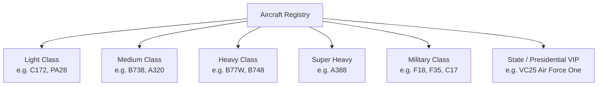

# SkyControl: Aircraft Performance Database & Registry

To support an immersive and realistic flight environment, SkyControl contains a comprehensive **Aircraft Performance Database**. This database categorizes specific aircraft types—from light general aviation planes to the massive Airbus A380, high-speed military fighters, and elite presidential flights—defining their physical limits and specialized gameplay mechanics.

---

## 1. Aircraft Type Classifications

Aircraft are registered using their official **ICAO designators**. Each designator maps to a specific category, size weight class, and set of physical coefficients.



### TypeScript Performance Schema

```typescript
export interface AircraftPerformance {
  icaoCode: string; // e.g. "C172", "B738", "A388", "F18", "VC25"
  modelName: string; // e.g. "Cessna 172 Skyhawk", "Airbus A380-800"
  weightClass: 'L' | 'M' | 'H' | 'S'; // Light, Medium, Heavy, Super
  
  // Dimensions for Ground Collision (meters)
  wingspanMeters: number;
  lengthMeters: number;
  safetyRadiusMeters: number; // Collision detection boundary
  
  // Speed Limits (knots)
  maxTaxiSpeed: number;
  takeoffRotationSpeed: number; // Vr
  approachSpeed: number; // Vapp
  maxAirspeedTMA: number; // Max speed allowed in 40km terminal airspace
  minAirspeedTMA: number; // Stall fallback margin
  
  // Climb/Descent Performance
  maxClimbRate: number; // Feet per minute
  maxDescentRate: number; // Feet per minute
  accelerationRateAir: number; // Knots/sec
  decelerationRateAir: number; // Knots/sec
  
  // Maneuvering Performance
  turnRateAir: number; // Degrees per second
  
  // Special Gameplay Rules
  specialRules: {
    wakeTurbulenceGenerator: boolean; // Generates dangerous wake vortex behind it
    wakeTurbulenceRequiredCategory: 'none' | 'light' | 'heavy' | 'super';
    priorityAirspaceAccess: boolean; // Must be routed first (State/Presidential)
    militaryManeuvering: boolean; // Capable of extreme tactical climbs and tight turns
  };
}
```

---

## 2. Comprehensive Aircraft Database Seeds

The game configures the following default registry, which will be loaded during simulation initialization:

### 1. General Aviation (Light Class)
*   **`C172` (Cessna 172 Skyhawk):** Very slow, highly responsive, low runway distance requirements.
*   **`PA28` (Piper PA-28 Cherokee):** Standard light single-engine trainer.

### 2. Commercial Airliners (Medium Class)
*   **`B738` (Boeing 737-800):** Workhorse airliner. Medium size, standardized climb rates and approach speeds.
*   **`A320` (Airbus A320):** Similar behavior to the B738, representing standard commercial commuter flights.

### 3. Long-Haul Giants (Heavy & Super Heavy Class)
*   **`B77W` (Boeing 777-300ER):** Heavy class. Requires larger runway lengths and creates standard wake turbulence.
*   **`A388` (Airbus A380-800):** **Super Heavy class.**
    *   *Wingspan:* 80 meters (safety radius: 45 meters).
    *   *Gameplay Impact:* Creates massive **Wake Turbulence**. Any trailing plane must maintain a **6 Nautical Mile separation** behind it (instead of the standard 3NM). If a plane enters the airspace envelope behind an A380 within 6NM, they suffer a "Wake Turbulence Incident" and lose control!

### 4. High-Performance Military (Military Class)
*   **`F18` (F/A-18 Hornet) / `F35` (F-35 Lightning II):**
    *   *Maneuverability:* Can perform extreme tactical standard rate turns ($6^\circ$/sec instead of $2^\circ$/sec) and vertical climbs ($12,000$ ft/min).
    *   *Approach:* High approach speeds ($155\text{ kts}$), requiring immediate clearances to avoid running out of fuel (rapid fuel burn rate).
*   **`C17` (Boeing C-17 Globemaster III):** Heavy military cargo transport. Slow speeds but climbs rapidly and has very short landing capabilities.

### 5. Government & Presidential Elite (VIP Class)
*   **`VC25` (Boeing VC-25 - Air Force One / "REP" State Flights):**
    *   *Special Rule (Absolute Priority):* Presidential flights possess **Priority Airspace Access**.
    *   *Gameplay Impact:* The moment VC25 enters the airspace:
        *   All other aircraft must yield.
        *   If VC25 is forced to vector or execute a "Go-Around", the player receives a massive score penalty.
        *   Routing VC25 directly and landing them ahead of schedule grants huge score multipliers.
        *   The callsign changes dynamically to **"Air Force One"** when the President is confirmed on board.

---

## 3. Database Reference Data (JSON Seed)

```json
{
  "aircraftRegistry": [
    {
      "icaoCode": "C172",
      "modelName": "Cessna 172 Skyhawk",
      "weightClass": "L",
      "wingspanMeters": 11,
      "lengthMeters": 8.2,
      "safetyRadiusMeters": 15,
      "maxTaxiSpeed": 15,
      "takeoffRotationSpeed": 65,
      "approachSpeed": 70,
      "maxAirspeedTMA": 120,
      "minAirspeedTMA": 50,
      "maxClimbRate": 700,
      "maxDescentRate": 500,
      "accelerationRateAir": 2.0,
      "decelerationRateAir": 1.5,
      "turnRateAir": 3.0,
      "specialRules": {
        "wakeTurbulenceGenerator": false,
        "wakeTurbulenceRequiredCategory": "none",
        "priorityAirspaceAccess": false,
        "militaryManeuvering": false
      }
    },
    {
      "icaoCode": "A388",
      "modelName": "Airbus A380-800",
      "weightClass": "S",
      "wingspanMeters": 80,
      "lengthMeters": 73,
      "safetyRadiusMeters": 45,
      "maxTaxiSpeed": 20,
      "takeoffRotationSpeed": 150,
      "approachSpeed": 140,
      "maxAirspeedTMA": 250,
      "minAirspeedTMA": 135,
      "maxClimbRate": 2800,
      "maxDescentRate": 2000,
      "accelerationRateAir": 1.0,
      "decelerationRateAir": 0.8,
      "turnRateAir": 1.5,
      "specialRules": {
        "wakeTurbulenceGenerator": true,
        "wakeTurbulenceRequiredCategory": "super",
        "priorityAirspaceAccess": false,
        "militaryManeuvering": false
      }
    },
    {
      "icaoCode": "F18",
      "modelName": "F/A-18 Hornet",
      "weightClass": "M",
      "wingspanMeters": 13.6,
      "lengthMeters": 17.1,
      "safetyRadiusMeters": 12,
      "maxTaxiSpeed": 25,
      "takeoffRotationSpeed": 130,
      "approachSpeed": 155,
      "maxAirspeedTMA": 350,
      "minAirspeedTMA": 110,
      "maxClimbRate": 12000,
      "maxDescentRate": 8000,
      "accelerationRateAir": 15.0,
      "decelerationRateAir": 8.0,
      "turnRateAir": 6.0,
      "specialRules": {
        "wakeTurbulenceGenerator": false,
        "wakeTurbulenceRequiredCategory": "none",
        "priorityAirspaceAccess": false,
        "militaryManeuvering": true
      }
    },
    {
      "icaoCode": "VC25",
      "modelName": "Boeing VC-25 (Air Force One)",
      "weightClass": "H",
      "wingspanMeters": 59.6,
      "lengthMeters": 70.6,
      "safetyRadiusMeters": 35,
      "maxTaxiSpeed": 20,
      "takeoffRotationSpeed": 145,
      "approachSpeed": 135,
      "maxAirspeedTMA": 250,
      "minAirspeedTMA": 130,
      "maxClimbRate": 3000,
      "maxDescentRate": 2000,
      "accelerationRateAir": 1.2,
      "decelerationRateAir": 1.0,
      "turnRateAir": 1.5,
      "specialRules": {
        "wakeTurbulenceGenerator": true,
        "wakeTurbulenceRequiredCategory": "heavy",
        "priorityAirspaceAccess": true,
        "militaryManeuvering": false
      }
    }
  ]
}
```
