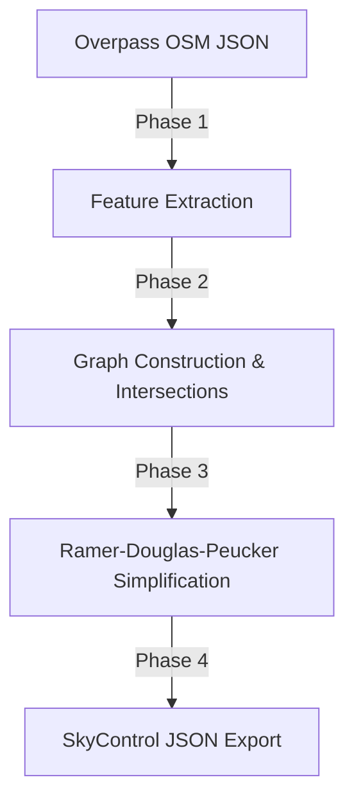

# SkyControl: Real-World Airport Conversion Pipeline

To achieve realistic maps of any real-world airport without manually drafting coordinates, SkyControl uses a semi-automated **Spatial Data Conversion Pipeline** that extracts real-world geospatial data from **OpenStreetMap (OSM)** and compiles it directly into our custom **Graph-Based Airport Data Model**.

---

## 1. Spatial Data Source: OpenStreetMap (OSM) via Overpass API

OpenStreetMap has highly detailed, globally crowd-sourced geographic data for almost every airport in the world. Instead of downloading gigabytes of maps, we use the **Overpass API** (a read-only API that serves custom queries of OSM data) to target a specific airport by its ICAO code.

### The Overpass Query (Example for Boston Logan - KBOS)

We execute an HTTP POST request to the Overpass API with a query designed to extract only airport-related elements (`aeroway` tags) within the boundary of our target airport:

```query
[out:json][timeout:25];
// Find the airport area by ICAO code
area["icao"="KBOS"]->.airportArea;
(
  // Fetch all runways, taxiways, terminals, and gates
  way(area.airportArea)["aeroway"="runway"];
  way(area.airportArea)["aeroway"="taxiway"];
  node(area.airportArea)["aeroway"="gate"];
  node(area.airportArea)["aeroway"="apron"];
);
// Output coordinates and geometries
out body;
>;
out skel qt;
```

---

## 2. The Conversion & Compilation Pipeline (OSM to SkyControl)

A utility script (written in Node.js or Python) will process the JSON returned by the Overpass API through the following phases:



### Phase 1: Feature Extraction
*   **Runways:** Identify OSM `ways` tagged `aeroway=runway`. Extract the start and end coordinates. Compute the heading and assign the runway designator (e.g., `04L/22R`) from the `ref` tag.
*   **Gates:** Identify OSM `nodes` tagged `aeroway=gate`. Extract their coordinates and gate labels (`ref` tag like `B12`).
*   **Taxiways:** Extract OSM `ways` tagged `aeroway=taxiway`. Group them by their taxiway letters (e.g., `Alpha`, `Kilo` in `ref` tags).

### Phase 2: Graph Construction & Intersection Finding
This is the core algorithmic step to build our A* pathfinding network:
1.  **Node Generation:** 
    *   Place a `TaxiNode` at every coordinate where two taxiway lines intersect.
    *   Place a `TaxiNode` at the connection point between a taxiway and a runway.
    *   Place a `TaxiNode` at gate parking locations.
2.  **Edge Mapping:**
    *   Split the taxiway lines at each intersection node.
    *   Create a `TaxiEdge` connecting adjacent intersection nodes. Assign the taxiway letter (e.g., `A`) to this edge.

### Phase 3: Graph Simplification & Cleanup
Raw OSM data contains extra nodes to define curved taxiways. To keep our rendering and pathfinding ultra-lightweight:
*   **Ramer-Douglas-Peucker (RDP) Algorithm:** Simplify curved paths into straight segments while preserving their visual shape within a 2-meter tolerance.
*   **Clustering:** Merge nodes that are closer than 5 meters to clean up messy multi-lane intersections into a single, clean node.

---

## 3. The Development & Refinement Tool

To ensure maps are perfectly functional, our Next.js/Vite environment will include a **Developer Map Tool**:

1.  **Map Viewer:** Displays the parsed JSON graph.
2.  **Pathfinding Validation Test:** Click two nodes (e.g., Gate B12 to Runway 27 threshold) and visualize the A* computed path immediately.
3.  **Manual Tweak Overlay (Optional):** A lightweight UI overlay that lets us add missing edges, move gates slightly, or rename taxiways in our JSON before saving the finalized airport file.

---

## 4. Architectural Reference: `thomasdubdub/airports-osm`

During brainstorming, we analyzed the open-source GitHub project **`thomasdubdub/airports-osm`** (by thomasdubdub):

### Analysis & Core Takeaways:
* **The Project:** A Python-based spatial utility that utilizes `OSMnx`, `GeoPandas`, and `Matplotlib` to query OpenStreetMap and download/render runway and aerodrome geometries.
* **Validation:** It confirms that OpenStreetMap's `aeroway` attributes (specifically `aeroway=runway`, `aeroway=taxiway`, and `aeroway=gate`) are extremely accurate, up-to-date, and are the industry-standard source for programmatic airport parsing.
* **Our Architectural Strategy (Updated via Brainstorming):**
  * **Static Preprocessed Assets:** Rather than calling the public Overpass API directly in the player's browser during gameplay (which introduces latency, rate limits, and external API downtime risks), we will **preprocess and store the compiled airport JSON files as static assets** in the game's public folder (e.g., `/public/maps/{icao}.json`).
  * **Benefits of Preprocessing:**
    * **100% Uptime & Latency-Free:** Airports load in milliseconds with absolute reliability and zero external API dependencies.
    * **Quality Assurance & Connectivity Verification:** OpenStreetMap data can occasionally be noisy or contain disconnected segments. Preprocessing allows us to run connectivity checks, verify that the A* pathfinding graph is 100% connected from all gates to all runways, and ship a perfectly hand-curated and polished library of the world's busiest airports (e.g., top 100/500 international hubs).
    * **Developer / Power User Parser:** We will preserve our native TypeScript/Node parser as an offline or developer command-line utility. If we want to add any new airport in the future, we simply run the parser tool, verify it in our Developer Map Tool, and save the resulting JSON straight to the static assets!
