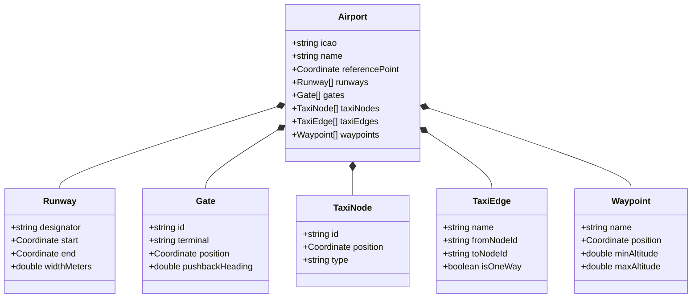

# SkyControl: Airport Data Model & GUI Design

To support infinite scalability and easy creation of real-world airports from code, SkyControl utilizes a highly structured **Graph-Based Airport Data Model**. This document defines the schema for our airport metadata and outlines our proposed hybrid 2D/3D GUI architecture.

---

## 1. The Airport Data Model (JSON / TypeScript)

Airports are modeled as spatial graphs, enabling **automatic pathfinding** (using A* search) for taxi instructions and precise coordinate mapping for rendering.



### TypeScript Data Schema

```typescript
interface Coordinate {
  lat: number;
  lng: number;
  alt?: number; // In feet
}

interface Runway {
  designator: string; // e.g. "04L/22R"
  start: Coordinate;
  end: Coordinate;
  widthMeters: number;
}

interface Gate {
  id: string; // e.g. "Gate B12"
  terminal: string; // e.g. "B"
  position: Coordinate;
  pushbackHeading: number; // Degree angle for pushback direction
}

// Nodes represent intersections, gate entries, or runway entrances
interface TaxiNode {
  id: string; // Unique node ID
  position: Coordinate;
  type: 'intersection' | 'gate_entry' | 'runway_entry' | 'hold_short';
}

// Edges represent actual taxiway segments linking nodes
interface TaxiEdge {
  name: string; // e.g. "Alpha", "Bravo", "Kilo"
  fromNodeId: string;
  toNodeId: string;
  isOneWay: boolean;
}

// Waypoints used for Radar approach and departure routing
interface AirspaceWaypoint {
  name: string; // e.g. "BLUEM", "WOODY"
  position: Coordinate;
}

interface Airport {
  icao: string; // e.g. "KBOS"
  name: string; // e.g. "Boston Logan"
  referencePoint: Coordinate;
  runways: Runway[];
  gates: Gate[];
  taxiNodes: TaxiNode[];
  taxiEdges: TaxiEdge[];
  waypoints: AirspaceWaypoint[];
}
```

---

## 2. Realistic Example: Boston Logan (KBOS) Minimal Seed

Here is how a real-world airport looks under this model. This structured structure makes it trivial to seed airports from a database or a local JSON file.

```json
{
  "icao": "KBOS",
  "name": "Boston Logan International Airport",
  "referencePoint": { "lat": 42.3643, "lng": -71.0052 },
  "runways": [
    {
      "designator": "04L/22R",
      "start": { "lat": 42.3551, "lng": -71.0142 },
      "end": { "lat": 42.3732, "lng": -70.9995 },
      "widthMeters": 45
    },
    {
      "designator": "09/27",
      "start": { "lat": 42.3618, "lng": -71.0210 },
      "end": { "lat": 42.3639, "lng": -70.9930 },
      "widthMeters": 45
    }
  ],
  "gates": [
    { "id": "B12", "terminal": "B", "position": { "lat": 42.3621, "lng": -71.0112 }, "pushbackHeading": 180 },
    { "id": "B15", "terminal": "B", "position": { "lat": 42.3625, "lng": -71.0108 }, "pushbackHeading": 180 }
  ],
  "taxiNodes": [
    { "id": "node_b12_entry", "position": { "lat": 42.3619, "lng": -71.0112 }, "type": "gate_entry" },
    { "id": "int_alpha_kilo", "position": { "lat": 42.3600, "lng": -71.0125 }, "type": "intersection" },
    { "id": "rwy_04L_entry", "position": { "lat": 42.3552, "lng": -71.0141 }, "type": "runway_entry" }
  ],
  "taxiEdges": [
    { "name": "Kilo", "fromNodeId": "node_b12_entry", "toNodeId": "int_alpha_kilo", "isOneWay": false },
    { "name": "Alpha", "fromNodeId": "int_alpha_kilo", "toNodeId": "rwy_04L_entry", "isOneWay": false }
  ]
}
```

---

## 3. GUI Design Decisions: 2.5D Holographic "God Camera" & Environmental Engine

### Brainstorming & Decision Log

To bridge the absolute control and safety of a flat 2D layout with the visual depth and premium feel of 3D, we decided to elevate Option B into a **2.5D Holographic "God View"** combined with a dynamic **Environmental Weather & Time Engine**.

#### 1. The 2.5D "God Camera" (Orthographic Depth Projection)
*   **How it Works:** The airport map is rendered in an **Orthographic 3D Projection looking straight down**. Because it is orthographic, there is zero perspective distortion and **zero occlusion** (terminal buildings cannot block your view of taxiing aircraft).
*   **Visual Altitude Depth:** 
    *   **Extruded Structures:** Terminal buildings and control towers are extruded slightly to give them a tangible, architectural weight.
    *   **Altitude Ascent/Descent:** When an aircraft takes off, its 2D vector icon physically lifts "up" toward the camera (gradually scaling larger) and casts a **dynamic, realistic shadow** onto the ground below. As the plane climbs, the shadow moves further away and softens, giving a perfect, intuitive sense of altitude.
    *   **Tactile Camera Tilt:** Players can hold a modifier key to slightly tilt the camera by 5–15 degrees, making the airport look like a glowing, holographic glass-model miniature sitting on a tactical command table.

#### 2. Environmental Weather & Time Engine
To add atmospheric drama and high-fidelity challenge, the 2.5D screen will dynamically shift themes and render visual weather overlays:

*   **Sleek Time-of-Day Transitions:**
    *   *Day Mode:* High-contrast vector layouts with crisp, clean shadows.
    *   *Dusk/Sunset:* Soft amber, gold, and magenta glows across the runways with long, dramatic architectural shadows stretching across the tarmac.
    *   *Night Mode:* The background fades to deep charcoal/pitch black. The screen comes alive with glowing taxiway edge lights (cyan/blue/amber neon dots), pulsing runway approach strobes, and planes casting bright, volumetric white cones of **landing light spotlights** onto the taxiways ahead of them.
*   **Dynamic Weather Overlays:**
    *   *Rain:* Slanted vector raindrops cutting across the screen, creating faint, concentric ripple rings when they hit the runway surfaces.
    *   *Snow:* Floating white flakes drifting across the display, with taxiways gradually receiving a subtle white/frosty highlight.
    *   *Fog / Instrument Conditions (IMC):* A moving misty fog noise layer. In dense fog, planes become completely invisible to the naked eye; players must **rely 100% on the glowing radar sweeps and transponder data tags** to guide them, dramatically elevating the gameplay stress and realism.
    *   *Crosswind Crabbing:* The simulation engine calculates wind directions. During crosswinds, planes landing or departing will physically **"crab" (align their nose into the wind)** while tracking the runway centerline, creating highly realistic landing trajectories.

---

### UI/UX Rendering Strategy

| Game Mode | Rendering Engine | Perspective | Environmental Effects |
| :--- | :--- | :--- | :--- |
| **Ground & Tower** | **HTML5 Canvas / Three.js (Orthographic)** | **2.5D God View (Looking Down)** | Shifting time-of-day lighting, dynamic aircraft shadows based on altitude, and local taxiway spotlights. |
| **Departure & Arrival** | **HTML5 Canvas / Three.js (Orthographic)** | **2.5D Radar Scope** | Bounded radar sweeping, wind drift vectors (crabbing), and storm cell overlays showing convective weather to avoid. |

---

### Tactical Cyberpunk Visual Styling

To ensure the interface looks modern and premium, we employ a highly polished, sci-fi vector design system:

*   **Glowing Vector Centerlines:** Taxiway routes glow with soft neon intensity (Dim Amber for idle routes, pulsing Cyan/Blue when an active taxi route is computed and assigned to a plane).
*   **Smooth Micro-Animations:** Aircraft icons glide smoothly and rotate with physical damping when turning corners at taxiway nodes.
*   **Glassmorphism HUD Overlays:** Selecting a plane displays a floating, semi-transparent data tag showing its Flight ID, aircraft model, active speed, current altitude, and destination gate, featuring animated signal-strength wave bars.
*   **Active Runway occupancy alerts:** Runways outline in a pulsing neon Red when occupied or when an aircraft is cleared to cross, transitioning to glowing neon Green when cleared for takeoff or landing.
*   **Tactile Soundscapes:** Low-frequency radar hums, clicking switches when toggling commands, and authentic VHF pilot callout static.


