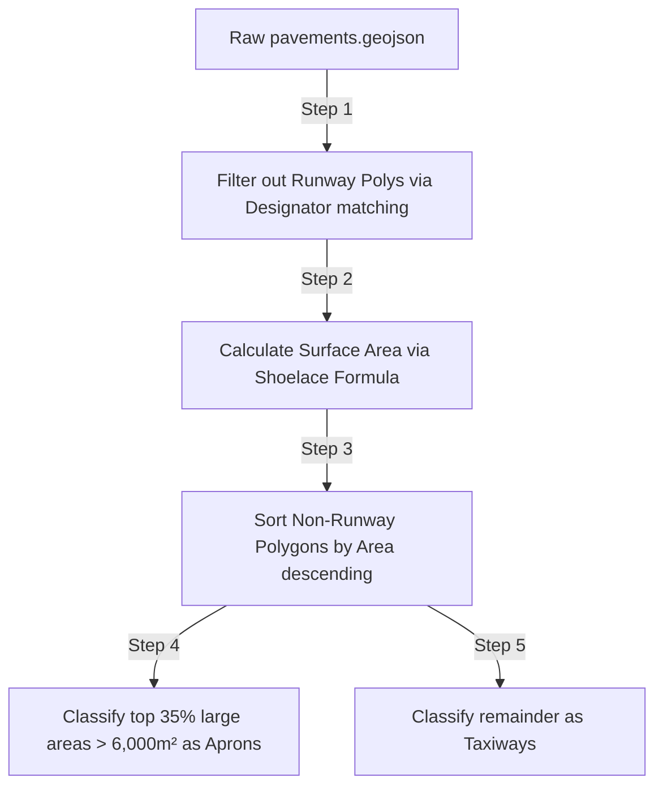

# SkyControl: High-Fidelity X-Plane Airport Scenery Data Pipeline

To achieve highly detailed, high-fidelity ground and tower ATC simulation maps, SkyControl leverages data from the **X-Plane Scenery Gateway**. This documentation details the end-to-end data pipeline, including fetching raw apt.dat files, converting them to GeoJSON features, and post-processing them into spatial layers ready for MapLibre rendering.

---

## 1. Spatial Data Source: X-Plane Scenery Gateway

The **X-Plane Scenery Gateway** is a crowd-sourced repository of airport layouts created by the flight simulation community. X-Plane scenery data uses the standard **apt.dat** file format which lists precise runways, taxiways, pavements, lines, markings, signs, and gate startup locations.

### Supported Airports in SkyControl
- **KSFO** — San Francisco Intl
- **KJFK** — John F Kennedy Intl
- **KLAX** — Los Angeles Intl
- **KBOS** — Boston Logan Intl
- **VIDP** — Indira Gandhi Intl (Delhi)

---

## 2. Spatial Data Fetching & Initial Conversion

We execute a Python-based pipeline utilizing two specific libraries to download scenery pack layouts directly from the Gateway API:
1. `xplane_airports` — Communicates with the Gateway API and parses the binary/text scenery formats.
2. `xplane_apt_convert` — Translates parsed X-Plane records into standard GeoJSON features using Fiona / GDAL drivers.

### Fetching Script (`/scripts/fetch_all_airports.py`)
This script downloads scenery packs and exports individual GeoJSON layers and a combined multi-layer file containing all features:

```python
from xplane_airports.gateway import scenery_pack
from xplane_apt_convert import ParsedAirport

# Fetch KSFO pack
pack = scenery_pack('KSFO')
apt = pack.apt
p_apt = ParsedAirport(apt)

# Exports individual layered features (Runway, Taxiway, Apron, etc.)
p_apt.export('KSFO_all.geojson', driver='GeoJSON')
```

This raw export generates the following key source layers inside `/public/maps/xplane/{ICAO}/`:
- `{ICAO}_all.boundary.geojson` — Airport physical boundaries.
- `{ICAO}_all.pavements.geojson` — Polygons for all aprons, runways, and taxiways.
- `{ICAO}_all.linear_features.geojson` — Line features including centerlines, hold lines, boundaries, and markings.
- `{ICAO}_all.startup_locations.geojson` — Node features representing parking gates, ramps, and tie-down spots.
- `{ICAO}_all.signs.geojson` — Node features specifying airfield guidance and destination signs.
- `{ICAO}_all.windsocks.geojson` — Node features containing windsock positions.

---

## 3. Spatial Post-Processing & Pavement Classification

X-Plane pavement files (`{ICAO}_all.pavements.geojson`) do not inherently distinguish between **Aprons** (terminal boarding areas) and **Taxiways** (transition corridors). 

To resolve this and achieve high-fidelity rendering (different colors, line outlines), SkyControl runs `/scripts/combine_all_airports.py` to post-process raw scenery maps into a high-fidelity dataset structured within `/public/maps/xplane/{ICAO}/combined/`.



### The Post-Processing Steps

### Step 1: Sign Text Cleanup
X-Plane guidance signs contain proprietary markup strings such as `{@Y}R{^r}` (meaning: Yellow background with red lettering, right-facing indicator). A Regex utility converts these markup strings into standard text labels (e.g. `R`) displayed in the MapLibre style layers:
```python
# Clean markup tags like {@...}, {^...}, {@@,...}
cleaned = re.sub(r'\{[^{}]*\}', ' ', raw_sign_text)
feat['properties']['label'] = ' '.join(cleaned.split()).strip()
```

### Step 2: Smarter Area-Based Pavement Classification
In some airports (like KSFO), pavements have empty names, making them easy to identify as aprons. But for other airports (like KJFK, KLAX, KBOS), X-Plane exports all pavements with names like `New Taxiway 146`. 

To solve this, SkyControl uses a **geospatial Shoelace Formula** to compute area sizes and classify pavements:
1. **Runways**: Filtered out by checking if the pavement's name matches known runway designator references (e.g., `28R`, `10L`).
2. **Aprons**: The largest 35% of non-runway polygons with an area greater than $5\times 10^{-10}$ square degrees ($\approx 6000\text{ m}^2$) are classified as **Aprons** (getting a dark slate color `#161921`).
3. **Taxiways**: The remaining polygons are classified as **Taxiways** (getting a darker color `#1a1e28` with `#2a3142` outlines).

```python
def polygon_area_deg2(coords):
    """Approximate signed area of a polygon ring in degree^2 (shoelace formula)."""
    n = len(coords)
    if n < 3: return 0.0
    area = 0.0
    for i in range(n):
        j = (i + 1) % n
        area += coords[i][0] * coords[j][1]
        area -= coords[j][0] * coords[i][1]
    return abs(area) / 2.0
```

### Step 3: Linear Features Separation
Line layers are divided into distinct GeoJSON files for lightweight MapLibre loading and optimized styling:
- **`lines_holds.geojson`**: Identified by checking if `HOLD` is in the `painted_line_type` attribute. Gets bright red outline styling.
- **`lines_centerlines.geojson`**: Identified by checking for `CENTERLINE` or `BROKEN_WHITE`. Gets dashed bright-gray style.
- **`lines_edges.geojson`**: Identified by checking for `EDGE` or `BORDER`. Gets yellow solid boundary style.
- **`lines_other.geojson`**: Remaining miscellaneous painted stripes (e.g., solid white, solid red).

---

## 4. Jet Bridge Generation Pipeline (`/scripts/build_xplane_jetbridges.py`)

To render highly detailed gate layouts, we programmatically construct virtual **Jet Bridge LineStrings** connecting aircraft gate coordinates to the terminal building outline:

1. **Gate Coordinates**: Extracted from `startup_locations.geojson` where `location_type = 'gate'` and starts with `"Gate"`.
2. **Terminal building edge**: Large unnamed pavements (surfaces exceeding $10^{-6}\text{ deg}^2 \approx 120000\text{ m}^2$) represent terminal blocks.
3. **Nearest-Point Projection**: A mathematical projection maps each gate node $(g_x, g_y)$ to its closest segment along the nearest terminal building perimeter.
4. **Jet Bridge Line**: A LineString is generated from the gate node to the projected terminal point (extended slightly by $0.00002\text{ deg} \approx 2\text{ meters}$ to clear building edges), resulting in a custom `jetbridges.geojson` file.

---

## 5. Front-End Integration: MapLibre GL Rendering

The generated GeoJSON datasets are served directly from the public assets directory `/public/maps/xplane/{ICAO}/combined/` and bound to the React MapLibre map component `/src/components/HiFiMap/index.tsx`.

### Sizing and Resize Safeguard
To guarantee correct scaling under React 19:
1. The MapLibre map container element is bound directly to the high-level relative flex wrapper:
   ```tsx
   <div ref={mapContainer} className="flex-1 w-full relative">
   ```
2. The initial size calculations are evaluated synchronously on map mount, and an explicit `m.resize()` calculation is scheduled shortly after the load/ready events are triggered to prevent blank grey canvasses.
3. Fonts and Glyphs are supplied using an open-source glyph bundle:
   ```javascript
   glyphs: 'https://demotiles.maplibre.org/font/{fontstack}/{range}.pbf'
   ```
   *Note: Font stack properties `'text-font'` must only use actual glyph identifiers like `['Open Sans Bold', 'Arial Unicode MS Bold']` to prevent system stylesheet crashes.*
